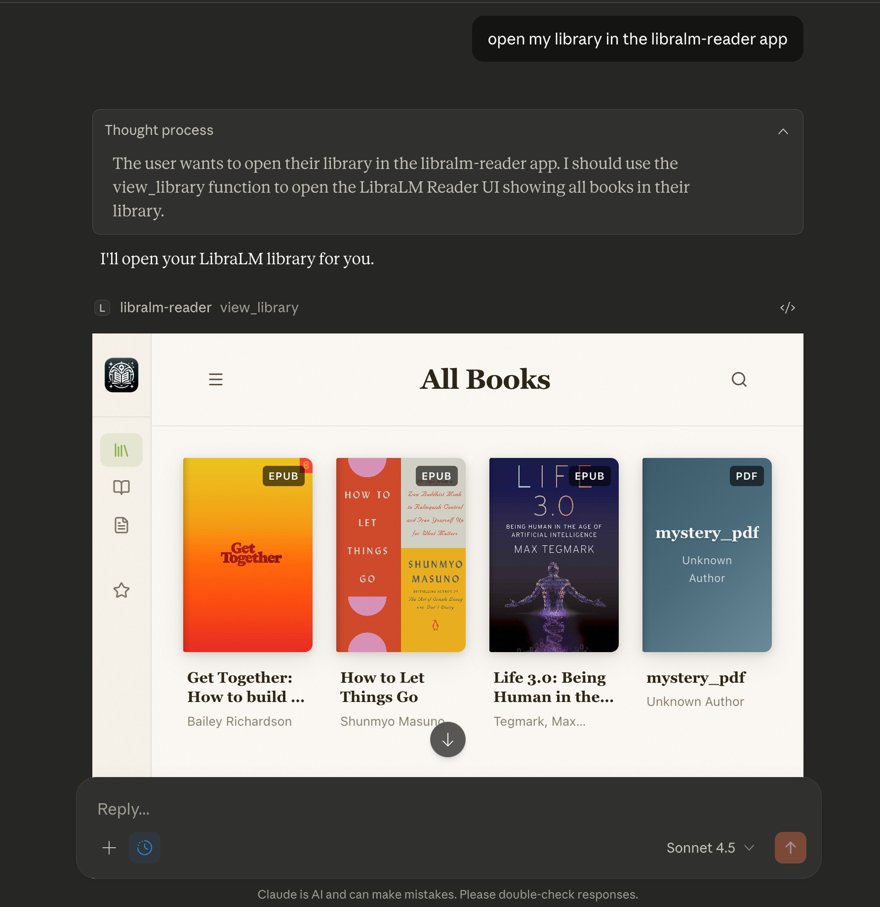
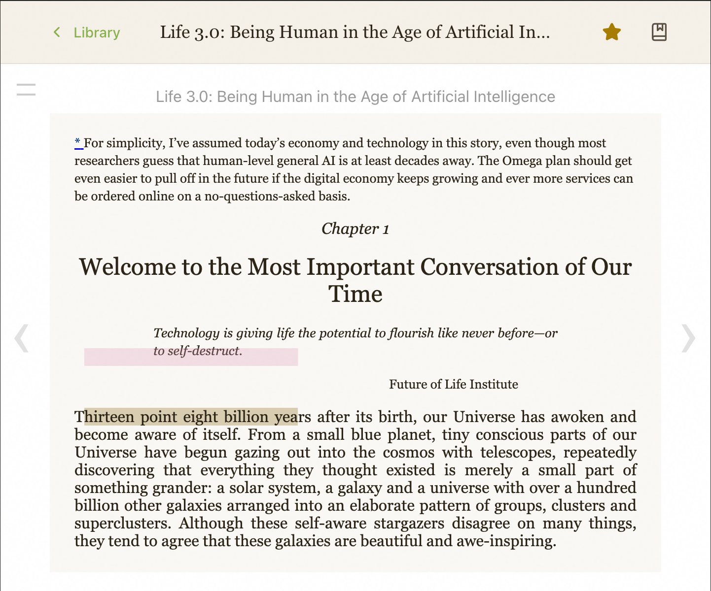
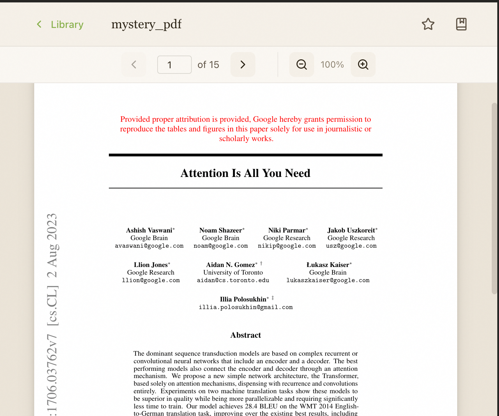
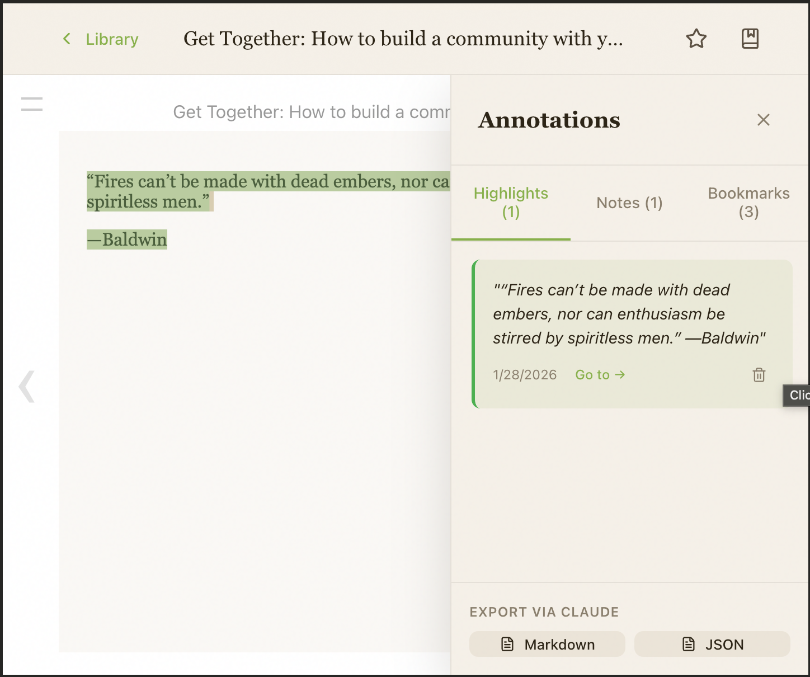
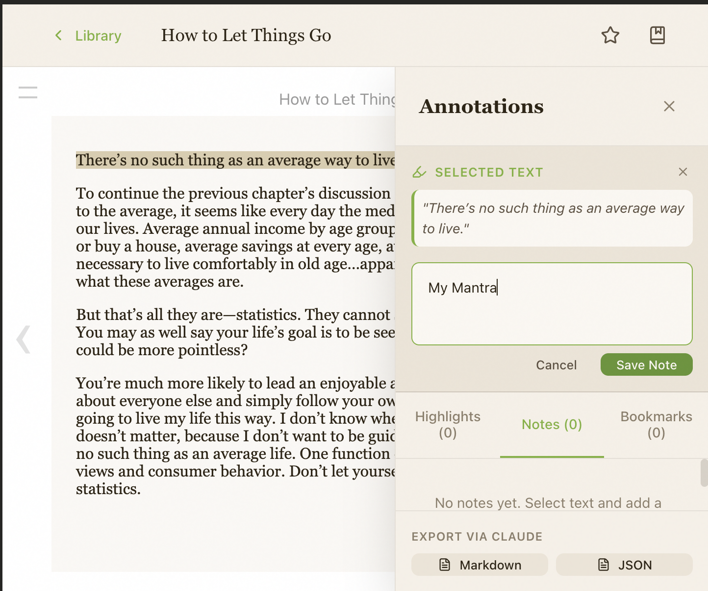
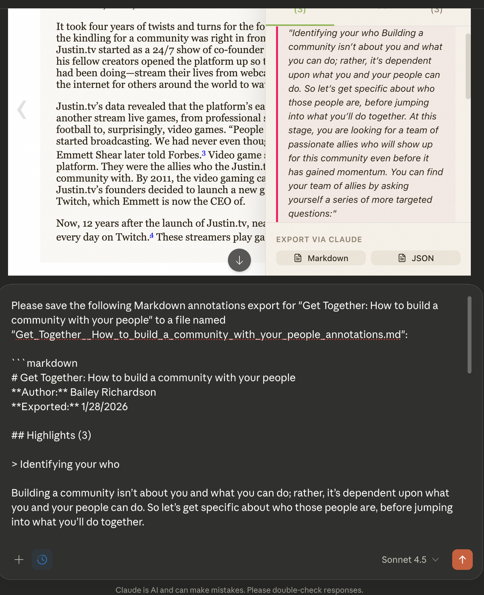
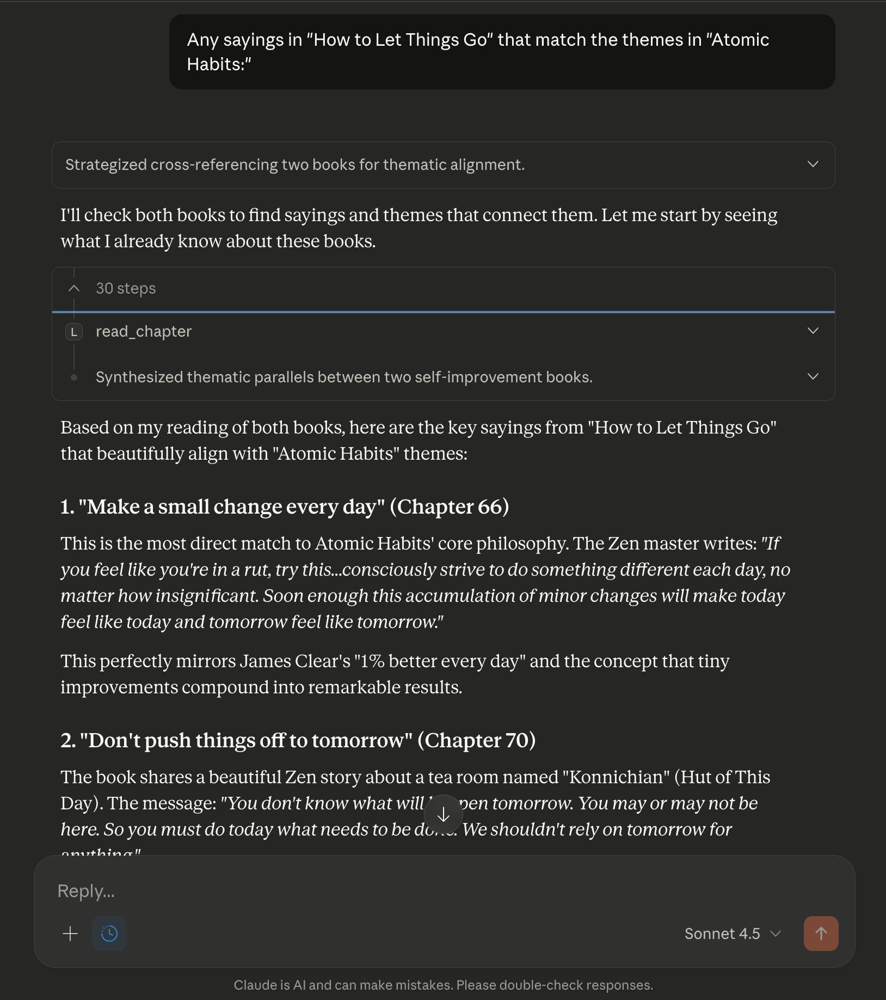
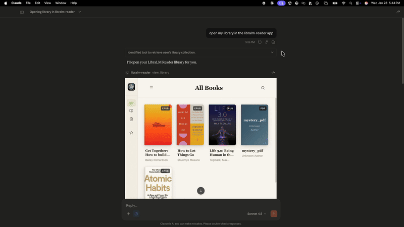

# LibraLM Reader

An **MCP App** for reading EPUBs and PDFs directly inside Claude Desktop. Point it to your books folder and enjoy a beautiful reading experience with AI-powered assistance.

[](https://www.npmjs.com/package/libralm-reader)  



## Features

- **Library View** - Browse your book collection with cover images in a clean grid
- **EPUB & PDF Support** - Read both formats with full navigation
- **Highlights & Notes** - Annotate as you read, with color-coded highlights
- **Reading Position** - Automatically remembers where you left off
- **Claude Integration** - Ask Claude about what you're reading: summaries, explanations, questions

### Feature Gallery

| EPUB Reading | PDF Reading | Highlighting |
|:---:|:---:|:---:|
|  |  |  |
| Beautiful EPUB rendering | Full PDF support with page navigation | Select text and add color-coded highlights |

| Notes | Export to Markdown | Library Research |
|:---:|:---:|:---:|
|  |  |  |
| Add notes to any passage | Export your annotations | Ask Claude questions across your entire library |

### See It In Action



## Installation (Claude Desktop)

Add LibraLM Reader to your Claude Desktop configuration:

**macOS**: `~/Library/Application Support/Claude/claude_desktop_config.json`
**Windows**: `%APPDATA%\Claude\claude_desktop_config.json`

```json
{
  "mcpServers": {
    "libralm-reader": {
      "command": "npx",
      "args": ["-y", "libralm-reader", "--stdio"],
      "env": {
        "BOOK_PATH": "/path/to/your/books"
      }
    }
  }
}
```

Replace `/path/to/your/books` with the directory containing your EPUB and PDF files.

Then restart Claude Desktop. The `view_library` tool will be available.

## Usage

1. **Open your library**: Ask Claude to "show my library" or "open LibraLM Reader"
2. **Browse books**: Click a book cover to start reading
3. **Navigate**: Use arrow keys or click page edges to turn pages
4. **Highlight text**: Select text and choose a highlight color
5. **Add notes**: Click the notes icon to add annotations
6. **Ask Claude**: "What am I reading?" or "Summarize this chapter"

## Sample Prompts

Once you have LibraLM Reader installed, try these prompts with Claude:

### Getting Started
- "Open my library in the libralm-reader app"
- "Show me my book collection"
- "What books do I have?"

### Understanding What You're Reading
- "Summarize what I'm currently reading"
- "What are the main themes of this book?"
- "Explain this concept to me like I'm 5"
- "What's the author's main argument in this chapter?"

### Deep Analysis
- "Create a character map showing relationships between all the characters"
- "What are the key takeaways from each chapter?"
- "Compare the ideas in this book to [another book in my library]"
- "Find contradictions or tensions in the author's arguments"

### Personal Application
- "How can I apply this framework to my own situation at work?"
- "Based on what I've highlighted, what seems to resonate with me most?"
- "Create an action plan based on the advice in this book"
- "What questions should I be asking myself after reading this?"

### Cross-Library Insights
- "What common themes appear across my business books?"
- "Which of my books discuss [topic]?"
- "Create a reading order for my books on [subject] from beginner to advanced"

### Creative Exploration
- "Write a dialogue between the authors of [Book A] and [Book B] debating their ideas"
- "What would [author] think about [current event]?"
- "Generate discussion questions for my book club"
- "Create flashcards from my highlights"

## Configuration

| Environment Variable | Default | Description |
|---------------------|---------|-------------|
| `BOOK_PATH` | `/path/to/your_books` | Directory containing your EPUB/PDF files |
| `DATA_PATH` | `~/.libralm` | Where to store library data and annotations |
| `PORT` | `3001` | HTTP server port (for development) |

## How It Works

LibraLM Reader is an **MCP App** - a special type of MCP server that also renders a UI. When you call the `view_library` tool, Claude Desktop displays the reader interface in an embedded panel.

### Architecture

```
Claude Desktop
    │
    ├── MCP App iframe (React UI)
    │       ├── Library grid with covers
    │       ├── EPUB reader (react-reader)
    │       └── PDF viewer
    │
    └── callServerTool() ←→ LibraLM MCP Server
                                 ├── EPUB/PDF parsing
                                 ├── Annotation storage (SQLite)
                                 └── Reading context sync
```

## MCP Tools

| Tool | Description |
|------|-------------|
| `view_library` | Opens the library UI |
| `get_current_context` | Gets current reading position and visible text |
| `search_highlights` | Searches through your highlights |
| `search_notes` | Searches through your notes |

## Data Storage

LibraLM stores data in `~/.libralm/`:

```
~/.libralm/
├── library.json      # Book catalog and metadata
├── session.json      # Reading positions
└── annotations.db    # SQLite database for highlights and notes
```

## Development

```bash
# Clone the repo
git clone https://github.com/libralm-ai/libralm-reader
cd libralm-reader

# Install dependencies
npm install

# Build everything
npm run build

# Run in HTTP mode (for testing with basic-host)
BOOK_PATH=/path/to/your_books npm run serve

# Development watch mode
npm run dev
```

### Local Development with Claude Desktop

To test local changes in Claude Desktop, use `bootstrap.ts` with tsx:

```json
{
  "mcpServers": {
    "libralm-reader": {
      "command": "npx",
      "args": ["--silent", "tsx", "/path/to/libralm-reader/src/bootstrap.ts", "--stdio"],
      "env": {
        "BOOK_PATH": "/path/to/your/books"
      }
    }
  }
}
```

This runs TypeScript directly without needing to rebuild after each change.

### Testing with basic-host

```bash
# Terminal 1: Run LibraLM
BOOK_PATH=/path/to/your_books npm run serve

# Terminal 2: Clone and run basic-host
git clone --depth 1 https://github.com/modelcontextprotocol/ext-apps.git /tmp/mcp-ext-apps
cd /tmp/mcp-ext-apps/examples/basic-host
npm install
SERVERS='["http://localhost:3001/mcp"]' npm run start
# Open http://localhost:8080
```

## Troubleshooting

**Books not showing up?**
- Verify `BOOK_PATH` points to a directory containing `.epub` or `.pdf` files
- Restart Claude Desktop after changing the configuration

**Check the logs:**
- macOS: `~/Library/Logs/Claude/mcp-server-libralm-reader.log`
- Windows: `%APPDATA%\Claude\logs\mcp-server-libralm-reader.log`

## License

Apache 2.0

## Credits

Built with:
- [MCP Apps SDK](https://github.com/modelcontextprotocol/ext-apps) - UI rendering in Claude Desktop
- [react-reader](https://github.com/gerhardsletten/react-reader) - EPUB rendering (epub.js wrapper)
- [PDF.js](https://mozilla.github.io/pdf.js/) - PDF rendering
- [epub2](https://github.com/nickvdh/epub2) - EPUB parsing
